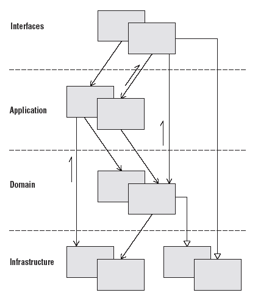
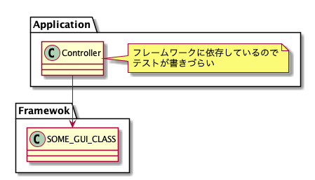
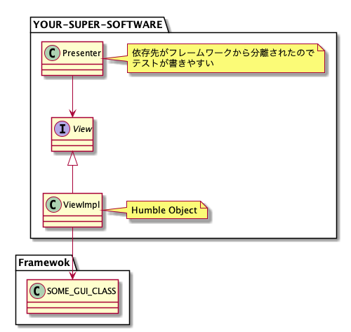
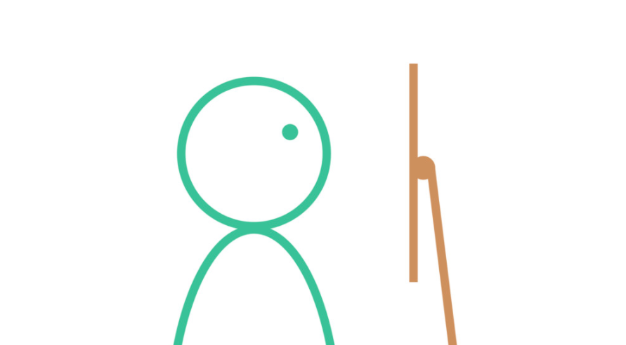
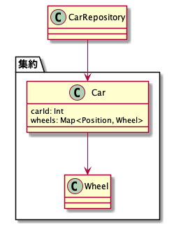
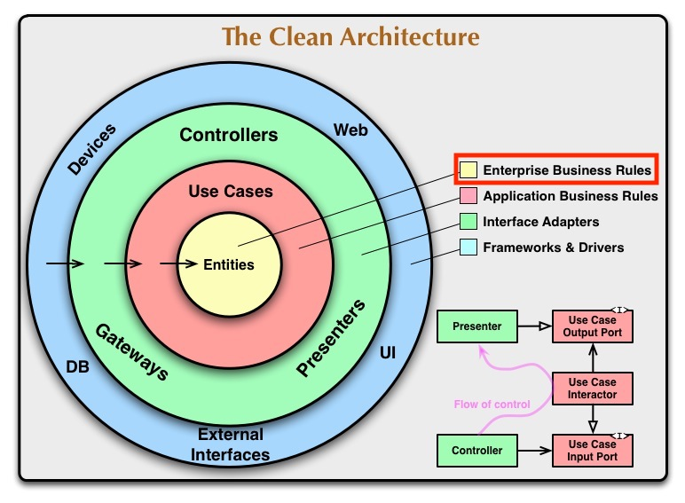
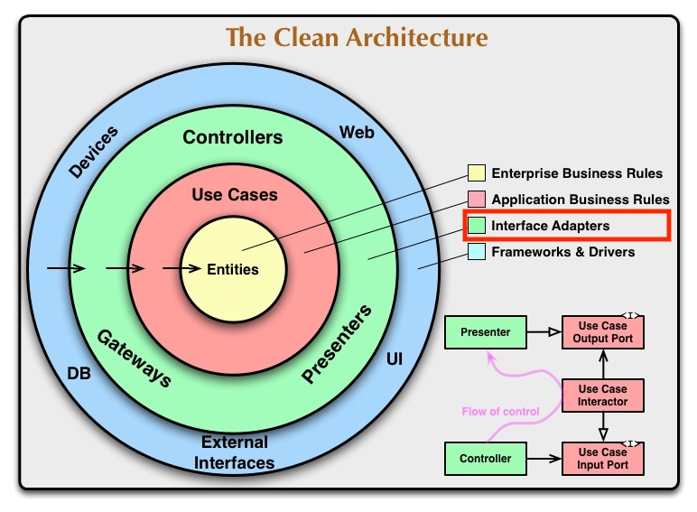

---

theme: gaia
class:
  - lead
paginate: true
_paginate: false
headingDivider: 1

title: 第五回 アーキテクチャ
description: 〈完全なプログラミング〉を目指す会 2020 アーキテクチャ編です
footer: 〈完全なプログラミング〉を目指す会 2020
_footer: ""

---

# <!--fit--> 〈完全なプログラミング〉を目指す会 2020

## <!--fit--> 第五回 アーキテクチャ

omuomugin

# <!--fit--> アーキテクチャ

# <!--fit-->の前に

# <!--fit--> **復習**

# <!--fit-->〈完全なプログラミング〉

## とは？

# <!--fit-->「読めば分かるコードを書く」<br>「必要十分なドキュメントを書く」


# <!--fit-->余計なモノを<br>一切必要としない


## ソフトウェアづくり


# <!--fit-->その心は？


# <!--fit-->コードは圧倒的に<br> **人間によって読まれる**


# <!--fit-->故に〈完全なプログラミング〉は<br>圧倒的に **はやい**


# <!--fit-->さらに


# <!--fit-->品質の改善は<br> **コストを削減する**


# <!--fit-->故に〈完全なプログラミング〉は<br>圧倒的に **やすい**


# <!--fit--> **はやい** <br> **やすい**


# <!--fit--> **うまい** <br> 😋

# 今回はアーキテクチャ編

# 今日持ち帰って欲しいこと

1. アーキテクチャを考えるために必要な一般的な知識
2. アーキテクチャについて議論できる下地を作ること
3. クリーンアーキテクチャのあの図を知識をもって読み解けるようになること

---

## あの図

# <!--fit-->なぜアーキテクチャを学ぶ必要があるか

---
> 優れたソフトウェア開発チームは、真正面から闘争に立ち向かう。ステークホルダーたちと対等に、ひるむことなく口論する。ソフトウェア開発者もステークホルダーであることは忘れてはいけない。**保護すべきソフトウェアに対する責任がある**。それがあなたの役割であり、義務である。それがあなたが雇われている大きな理由だ。
> 
> *&#x2014; Clean Architecture　達人に学ぶソフトウェアの構造と設計 Robert C.Martin*

# <!--fit-->アーキテクチャの目的は何か

---
> ソフトウェアアーキテクチャの目的は、求められるシステムを構築・保守するために**必要な人材を最小限に抑えること**である
> 
> *&#x2014; Clean Architecture　達人に学ぶソフトウェアの構造と設計 Robert C.Martin*

# <!--fit-->では、どうあるべきか？

---
> 優れたアーキテクチャは、**ユースケースを中心**にしているため、フレームワーク、ツール、環境に依存することなく、　ユースケースをサポートする構造を問題なく説明できる。
> 
> *&#x2014; Clean Architecture　達人に学ぶソフトウェアの構造と設計 Robert C.Martin*

# ユースケースを中心

# **ユースケース** + 中心

# ユースケース

---


# 「ユースケース」とは何か

> 自動化されたシステムを定義・制限することによって、ビジネスのお金を生み出したり節約したりする **ビジネスルール** もある
> 
> *&#x2014; Clean Architecture　達人に学ぶソフトウェアの構造と設計 Robert C.Martin*

# ビジネスルール

---


# 「ビジネスルール」とは何か
### ビジネスを成り立たせる重要なルール
### <!--fit-->ビジネスルールを理解すれば、「誰を相手にしていて、どんな業務を提供しているのか」が理解できる。

# 銀行のアプリケーションを例にとる

# 「銀行がN%の利子をつける」

# **エンタープライズ**ビジネスロジック
### <!--fit-->利子をコンピュータで計算しようとそろばんで計算しようと関係ない

# **エンタープライズ**ビジネスロジック
## <!--fit--> a.k.a ドメインモデル、ドメインサービス、エンティティ、最重要ビジネスルール、etc...

- アプリケーションがなくても存在するビジネスルール
- i.e. ステークホルダーと共通認識ができるようなルール

# **アプリケーション**ビジネスロジック
## 「新規でローンを作成する」
- ローン担当者が連絡先を収集、検証して、与信スコアが500以上であることを確認するまでローンの支払い見積もりを提示しない
-> 連絡先情報が入力されて、値が検証され、与信スコアが500以上あることを確認するまでは支払い見積もりの画面に進まないようにシステムを設定する
- **システムでどう自動化されるか**

# **アプリケーション**ビジネスロジック
## <!--fit--> a.k.a アプリケーションサービス、ユースケース、etc...

- ビジネスルールのうちアプリケーションによって達成されるもの
- アプリケーション固有のビジネスルールを記述

# <!--fit-->自分が関わってるプロダクトで考えてみよう
## <!--fit-->エンタープライズビジネスロジック、アプリケーションビジネスロジック、その他

# ユースケース + **中心**

# 「中心」に据えるとは

# 【再掲】
## アーキテクチャの目的は何か

---
> ソフトウェアアーキテクチャの目的は、求められるシステムを構築・保守するために**必要な人材を最小限に抑えること**である
> 
> *&#x2014; Clean Architecture　達人に学ぶソフトウェアの構造と設計 Robert C.Martin*

# これを妨げるのは？

---
> 人々のパワーを奪うものは何か？それは **結合** である。それも早すぎる決定との結合である。
> 
> *&#x2014; Clean Architecture　達人に学ぶソフトウェアの構造と設計 Robert C.Martin*

# **結合** をやめていく = 疎結合

# システムの境界 (バウンダリー)
> ソフトウェアの要素を分離し、**お互いのことがわからない**ように制限するというもの
> 
> *&#x2014; Clean Architecture　達人に学ぶソフトウェアの構造と設計 Robert C.Martin*

---


# そういえばSOLID原則覚えてますか？

---
- 単一責任の原則 (Single Responsibility Principle)
- オープン・クローズドの原則 (Open-Closed Principle)
- リスコフの置換原則 (Liskov Substitution Principle)
- インターフェイス分離の原則 (Interface Segregation Principle)
- **依存性逆転の原則 (Dependency Inversion Principle)**

---

## まさに依存性が逆転している

---
> システムアーキテクチャがユースケースをサポートするものであり、フレームワークから少し距離を置いたものになっていれば、**フレームワークを使うことなく、すべてのユースケースのユニットテストを実行できる**はずだ。
> 
> *&#x2014; Clean Architecture　達人に学ぶソフトウェアの構造と設計 Robert C.Martin*

# 疎結合はテストも容易になる
テストを書くとうまい、やすい！😋
see also [質とスピード by t_wada](https://speakerdeck.com/twada/quality-and-speed-2020-autumn-edition)

---
> ドメイン関連のコードがそうした膨大な他のコードの中に拡散してしまうと、**コードを見て意味を理解するのがきわめて困難になる。**
> **ドメイン層を分離して**はじめて、モデル駆動開発が可能になるのだ。
> *&#x2014; ドメイン駆動設計 Eric Evans*

# ドメインを目立たせることも重要

# レイヤードアーキテクチャ
> 複雑なプログラムはレイヤに分割すること。各レイヤで設計を進め、凝集度を高めて下位層だけに依存するようにすること。標準的なアーキテクチャパターンに従って、上位のレイヤに対しては疎結合にすること。**ドメインモデルに関係するコード全部を１つの層に集中**させ、ユーザーインターフェース、アプリケーション、インフラストラクチャのコードから分離すること。
> 
> *&#x2014; ドメイン駆動設計 Eric Evans*

---


## <!--fit-->Domain Driven Development 
## の本に出てくる
## <!--fit-->レイヤードアーキテクチャ

# DDD本の説明と実装例
### <!--fit-->※Webアプリケーションやモバイルアプリケーションなどを想定<br>プラットフォームやビジネスドメインによって解釈や実装は変わりうる

---


# ルール
- 意味のあるレイヤーに分割されている
- レイヤー間の依存は、Domain Layer に向かって1方向になっている

---


# レイヤーの説明
- **ユーザーインターフェース層 (or プレゼンテーション層)**
- アプリケーション層
- ドメイン層
- インフラストラクチャ層

---
> ユーザーに情報を表示して、**ユーザーのコマンドを解釈する責務**を負う。外部のアクタは人間のユーザーではなく、別のコンピュータシステムのこともある
> 
> *&#x2014; ドメイン駆動設計 Eric Evans*

---


- Presenter
- View

# Presenter, Viewに関連する知識
- Humble Object Pattern
- Robot Pattern

# Humble Object Pattern

# Humble Object Pattern
> 振る舞いを2つのモジュールまたは、クラスに分割するだけである。ひとつのモジュールは「Humble(控えめ)」で、ここには**テストが難しい振る舞い**のみが含まれる。もうひとつのモジュールには、Humble Objectから取り除かれた**テストしやすい振る舞い**が含まれる。
> 
> *&#x2014; Clean Architecture　達人に学ぶソフトウェアの構造と設計 Robert C.Martin*

---


---


# Presenter と View
- View は Humble Objectである
- Presenter はテストが容易になったもう1つのモジュール

# Robot Pattern

# Robot Pattern
## <!--fit-->Jake Wharton という Android エンジニアが発表してたUIテストを書くためのパターン
## <!--fit-->直接的には、Presenter と View には関係ないがそれら2つの役割について考える参考になる
- see also 
  - https://jakewharton.com/testing-robots/
  - https://academy.realm.io/posts/kau-jake-wharton-testing-robots/

---


---

## <!--fit-->ロボットが操作しているかのように<br>イベントを抽象的に考えるパターン

---

## 決済端末を例に取る

---


# 「$100 を入力して決済する」 
```
findViewWithText("1").click();
findViewWithText("0").click();
findViewWithText("0").click();
findViewWithText("Send").click();

// 計算結果に時間がかかるかも
Theread.sleep(1000);

// 計算が成功したことを通知するテキストが出てくることを確認
findViewWithText("Success!");
```

# <!--fit-->「$100 を入力して決済する」 What と <br>実際のテストコードの How が混じってる

---

## How は Robot として表現する

---

## ロボットから見ると、
## <!--fit-->「数式を入力して、計算結果ボタンを押す」

---
```
// Test Code
PaymentRobot payment = new PaymentRobot();
payment.amount(100);
payment.send();

// e.g.
class PaymentRobot {
  PaymentRobot amount(int amount) { 
    findViewWithText("1").click();
    findViewWithText("0").click();
    findViewWithText("0").click();
  }

  void send() { 
    findViewWithText("Send").click();
  }
}
```

# Presenter と View に置き換えて考える

---


---

## Presenterは、
- 「決済ボタンが押され、料金を渡される」 というインターフェースを公開
- 呼び出されたら、必要な処理を呼んで計算の処理をする
- Viewにどういう状態を描画するかの結果を返す

---

## Viewは、
- 数字入力ボタンのアクションを監視して、入力された金額を保持
- 決済ボタンのアクションを監視
- 「決済ボタンを押された」 という通知をPresenterに送信する

---
```
interface View {
  void showSuccessMessage();
}

class ViewImpl implements View {
  // Event通知
  void onTapSend() {
    this.presenter.onTapSend(this.amount);
  }

  // 
  void showSuccessMessage() {
    // show "Success!";
  }
  // ...
}

class Presenter {
  void onTapSend(int ammount) {
    // ...
    // ユースケースに委譲したり、いろんな計算を行う
    // ...

    // 理想は ViewModel みたいなオブジェクトが渡せるとテストが容易
    this.view.showSuccessMessage();
  }
}
```

---

## <!--fit-->UIイベントを抽象化して<br>意味的な疎結合性を保つことが重要

# レイヤーの説明
- ユーザーインターフェース層 (or プレゼンテーション層)
- **アプリケーション層**
- ドメイン層
- インフラストラクチャ層

---
> **ソフトウェアが行うことになっている仕事を定義し、表現力豊かなドメインオブジェクトが問題を解決するように導く。** このレイヤが責務を負う作業は、**ビジネスにとって意味のあるものか、あるいは他システムのアプリケーション層と相互利用するものに必要なものである。** 
> 
> *&#x2014; ドメイン駆動設計 Eric Evans*

---


- UseCase

# UseCase 
####  a.k.a アプリケーションビジネスロジック
## 【再掲】
- ビジネスルールのうちアプリケーションによって達成されるもの
- アプリケーション固有のビジネスルールを記述

# レイヤーの説明
- ユーザーインターフェース層 (or プレゼンテーション層)
- アプリケーション層
- **ドメイン層**
- インフラストラクチャ層

---
> **ビジネスの概念とビジネスが置かれた状況に関する情報、およびビジネスルールを表す責務を負う。** ビジネスの状況を反映する状態はここで制御され使用されうるが、それを格納するという技術的な詳細は、インフラストラクチャに委譲される。 **この層がビジネスソフトウェアの核心である。**
> 
> *&#x2014; ドメイン駆動設計 Eric Evans*

---


- Domain Model
- Domain Service
- Repository

# Domain Model
#### a.k.a エンタープライズビジネスロジック
## 【再掲】
- 最も重要なレイヤー
- アプリケーションがなくても存在するビジネスルール
- i.e. ステークホルダーと共通認識ができるようなルール

# Domain Service
### そもそもServiceとは？

# Service
> 設計をできる限り明確にしつつ、実践的に進めていくと、**概念的にどのオブジェクトにも属さないような操作**が含まれることがある。強引に決着をつけるのではなく、問題領域に引かれる自然な輪郭に従って、モデルの中に明確にサービスを含めればよい。
> 
> *&#x2014; ドメイン駆動設計 Eric Evans*

# Service = モデルで表現できないもの
## <!--fit-->ドメインにも、アプリケーションにもインフラにもサービスはある
## <!--fit-->ただしなんでもかんでもサービスにするとドメインモデルがただのデータクラスになってしまう

# Domain Service
- ドメインモデルで表現しきれないような操作のうち、ドメインレイヤーにあるべきもの
- 通常は複数のドメインモデルを強調したようなビジネスルールを記述する

# Repository
> **集約ルート**に対してのみ、リポジトリを提供すること。クライアントをモデルに集中させ、あらゆるオブジェクトの格納とアクセスをリポジトリに委譲すること。
> 
> *&#x2014; ドメイン駆動設計 Eric Evans*

# 集約とは
- データには、作成されて、変更されて、削除されるという **ライフサイクル** がある
- ライフサイクルを通じて、**整合性の維持**が大変で**モデルが侵食されてしまう**場合がある
  - トランザクション
  - 関連したモデルの更新漏れ
  - etc...

---


---

## Wheel は常に Car の一部なので
## テーブル が異なっていても集約のルートは Car
## => ドメインモデルと同じ構造になる

# Repository
## <!--fit-->ドメインモデルと同様の構造を**集約**としてモデリングして、<br>**集約ルート**へのアクセス方法を提供する役割

# よくある間違い

## <!--fit--> ローカルとリモートのデータ取得などをうまく扱うラッパークラス


# Repository
## <!--fit-->ドメインモデルと同様の構造を**集約**としてモデリングして、<br>**集約ルート**へのアクセス方法を提供する役割

# レイヤーの説明
- ユーザーインターフェース層 (or プレゼンテーション層)
- アプリケーション層
- ドメイン層
- **インフラストラクチャ層**

---
> 上位のレイヤを支える**一般的な技術詳細を提供する**。これには、アプリケーションのためのメッセージ送信、ドメインのための永続化、ユーザーインターフェースのためのウィジェット描画などがある。インフラストラクチャ層は、ここで示す4層間における総悟利用のパターンもアーキテクチャフレームワークを通じてサポートすることがある。
> 
> *&#x2014; ドメイン駆動設計 Eric Evans*

---

- ViewImpl
- RepositoryImpl

# <!--fit-->View, Framework, DAO, API Client etc....
### 実装を他のレイヤーに提供する存在

# 4つの層だけか？

> ４つ以外にも必要なものはあるだろう。**この4つ以外は認めないというルールはない。** ただし依存性のルールは常に適用される。
> 
> *&#x2014; Clean Architecture　達人に学ぶソフトウェアの構造と設計 Robert C.Martin*

# 登場したクラスだけか？
## <!--fit-->レイヤードアーキテクチャの実装は、アプリケーションの特性や<br>プラットフォームの特性にもよるので課題を解決するためには<br>他にもクラスを作ってもよくてそれぞれのレイヤーの背景を理解することが大事。

# ユースケースを中心
## is
## 「ビジネスルールが明確に表現されており、<br>技術的な詳細からは疎結合になっている状態」

# まとめ

# <!--fit-->クリーンアーキテクチャの図を読み解いてみよう
## <!--fit-->今、関わってるプロダクトではどういう処理がどこに属しますか？

---


---


---


---


---


# 重要なことはこれだけ
## 「ビジネスルールが明確に表現されており、<br>技術的な詳細からは疎結合になっている状態」

# 話したこと
- アーキテクチャの目的
- ユースケースを中心にしたアーキテクチャ
- ビジネスルールとは
- レイヤードアーキテクチャ

# とにもかくにも

# 重要なことはこれだけ
## 「ビジネスルールが明確に表現されており、<br>技術的な詳細からは疎結合になっている状態」

# 付録

# Books
- Robert C.Martin. 「Clean Architecture　達人に学ぶソフトウェアの構造と設計」
- Eric Evans. 「ドメイン駆動設計」
- Martin Fowler. 「Patterns of Enterprise Application Architecture」

# Ref Articles
- https://blog.cleancoder.com/uncle-bob/2012/08/13/the-clean-architecture.html
- https://domainlanguage.com/ddd/reference/
- https://docs.microsoft.com/ja-jp/dotnet/architecture/microservices/microservice-ddd-cqrs-patterns/infrastructure-persistence-layer-design
- https://martinfowler.com/bliki/HumbleObject.html
- https://jakewharton.com/testing-robots/
- https://academy.realm.io/posts/kau-jake-wharton-testing-robots/

# 登場したキーワード
ビジネスルール、エンタープライズビジネスロジック、アプリケーションビジネスロジック、ドメインモデル、ドメインサービス、エンティティ、最重要ビジネスルール、アプリケーションサービス、ユースケース、バウンダリー、依存性逆転、レイヤードアーキテクチャ、Humble Object Pattern、Robot Pattern、Service、集約、Repository
