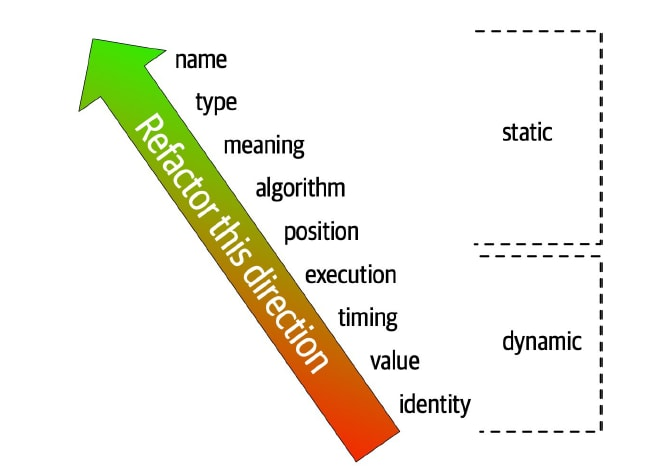

---

class:
  - lead
paginate: true
_paginate: false

title: 第五回 アーキテクチャ
description: 〈完全なプログラミング〉を目指す会 2020 アーキテクチャ編です
footer: 〈完全なプログラミング〉を目指す会 2020
_footer: ""
style: |
  @import url("https://fonts.googleapis.com/css2?family=Noto+Sans+JP&display=swap");
  section {
    font-family: 'Noto Sans JP', sans-serif;
  }

---

# <!--fit--> 〈完全なプログラミング〉を目指す会 2020

## <!--fit--> 第五回 アーキテクチャ

omuomugin

# <!--fit--> アーキテクチャ

# <!--fit-->の前に

# <!--fit--> **復習**

# <!--fit-->〈完全なプログラミング〉

## とは？

# <!--fit-->「読めば分かるコードを書く」<br>「必要十分なドキュメントを書く」


# <!--fit-->余計なモノを<br>一切必要としない


## ソフトウェアづくり


# <!--fit-->その心は？


# <!--fit-->コードは圧倒的に<br> **人間によって読まれる**


# <!--fit-->故に〈完全なプログラミング〉は<br>圧倒的に **はやい**


# <!--fit-->さらに


# <!--fit-->品質の改善は<br> **コストを削減する**


# <!--fit-->故に〈完全なプログラミング〉は<br>圧倒的に **やすい**


# <!--fit--> **はやい** <br> **やすい**


# <!--fit--> **うまい** <br> 😋

# <!--fit-->今回はアーキテクチャ編

# <!--fit-->今日持ち帰って欲しいこと

---

> ベストな「How」は「Why」でしか規定できない
> *&#x2014; [Mercari Bold Challenge "Why Microservices?" by @deeeet](https://speakerdeck.com/mercari/0924-bold-challenge-at-deeeet)*

see also [ベストな「How」は「Why」でしか規定できない メルカリがマイクロサービスに移行した理由と、その軌跡](https://logmi.jp/tech/articles/322218)

---

## <!--fit-->すべての解決策は<br>「なぜ」適用するかが大事

---

## <!--fit-->では本編

--- 

> よい設計は悪い設計よりも変更しやすい
> 我々が知る限り、この世のあらゆる設計原則は ETC (Easier to Change) 原則を特殊化したものとなっています
> *&#x2014; 達人プログラマ第二版 Tips14*

---

## 変更のしやすさが最も大事

---

## <!--fit--> なぜソフトウェアは<br>変更しにくくなってしまうのか

---

> ソフトウェアは「変化し続ける要求」と「戦略的ではない依存の追加や変更」によって腐っていく
> *&#x2014; Design Principles and Design Patterns, 2000, Robert C. Martin*

---

> ソフトウェアの複雑性は、「依存」と「曖昧さ」によって引き起こされる
> *&#x2014; Philosophy of Software Design*

---

## <!--fit--> 複雑なソフトウェアの3つの負
- Change Amplification: 変更箇所が多すぎる
- Cognitive Load: コードが理解できない
- Unknown Unknowns: そもそも何を変更すべきかわからない

---

## <!--fit-->変化し続ける要求に耐えながら<br>依存を完結に保つのが大事

---

## <!--fit-->疎結合かつ凝集性を高く

---

> 理想的な構造的な設計は、結合度を低くし、凝集性を高めることである
> *&#x2014; Comparing Techiniques by Means of Encapsulation and Connersence, 1992, Meilir Page-Jones*

---

## <!--fit-->疎結合と凝集性はお互いに表裏の関係にある

---

## Connascence (コナーセンス)
- 2つのソフトウェア要素 A, B があるときに一方を変更した際にもう一方も変更しないといけないような関係のこと
- 結合度と凝集性両方のメトリクスとして 1992 年に提案された
- e.g. パッケージ同士でコナーセンスがあるとそれは密結合になる

```kotlin
// Int -> String に変えた場合には ソフトウェア要素 B も変更する必要がある例
var a: Int // ソフトウェア要素 A 

a = 7  // ソフトウェア要素 B
```

---

## Connascence の強さ



---

疎結合かつ凝集性を高く
= <br> 境界外は「弱い」コナーセンスに<br>境界内は「強い」コナーセンスに

---

## 強いコナーセンスは、構造的にはわからない


---

## プログラムの「意味」を理解して<br>はじめてコナーセンスを判断できる

---

## ちょっとまた別の話

---

## 弱い凝集性
- 情報的凝集: 決まった順番で処理される必要があるだけ
- 連絡的凝集: 同じデータを利用しているものを集めただけ
- 時間的凝集: 同時に実行されるものを集めただけ
- 手順的凝集: 独立している処理が順番に並んでる
- 論理的凝集: 分岐処理が1つのルーチンに閉じ込められてる
- 偶発的凝集: たまたま一緒 (暗号的凝集とも呼ばれる)

> *&#x2014; Code Complete 上 第７章 高品質なルーチン*

---

## 強い凝集性
- 機能的凝集

> ルーチンが処理を1つだけ実行する場合である。ここでの評価は、それらのルーチンがその名前が示唆するとおりの処理を行うと前提してのものである。他にも何かの処理を行うとしたら、凝集性は弱まり、名前も適切とは言えなくなる。
> *&#x2014; Code Complete 上 第７章 高品質なルーチン*

---

## <!--fit-->「１つだけ」のサイズは？

---

> Software that fits in your head
> *&#x2014; Dan North (creator of BDD)*

---

> 複雑な問題を完全に詰め込めるほど大きな脳を持った人はいない by Edsger Dijkstra
> *&#x2014; Code Complete 上 第７章 高品質なルーチン*

---

## <!--fit-->サイズの決定権は、<br>「我々」に委ねられている

---

## <!--fit-->強い凝集性は<br>構造的にはわからない

---

## <!--fit-->プログラムの「意味」を理解して<br>はじめて凝集性の判断ができる

---

## <!--fit-->全ては、プログラムの「意味」を<br>理解するところから

---

## もう1つだけ例を

---

## どっちの方が優れてると思いますか？

```kotlin
// ① 引数を1つずつ渡す
fun doSomething(a: Int, b: Int, c: Int, d: Int)

// ② 引数に必要なものを1つのオブジェクトに詰めて渡す
fun doSomething(obj: SomeObj)

```

---

> これらの意見はどちらも短絡的で、ルーチンのインターフェイスが表す抽象概念とは何かという最も重要なポイントを見逃している。
> ルーチンは３つの要素が渡されることを期待していて、それらがたまたま同じオブジェクトによって提供されることが抽象化であるというなら、3つのデータ要素を個別に渡すべきだろう。
> しかし、常に特定のオブジェクトが存在し、ルーチンがそのオブジェクトを使って何かをすることが抽象化であるというなら、3つのデータ要素を公開した時点で、抽象化を崩壊させることになる。
> *&#x2014; Code Complete 上 第７章 高品質なルーチン*

---
## (再掲)
## 全ては、プログラムの「意味」を<br>理解するところから

---

## 小休憩がてら偉人のお言葉を

---

> パターンがより最悪の自体を招いたケースをある。
> 人々が本を読んで紹介されているパターンにワクワクしてまるで適用すればするほど良いソフトウェアになる魔法のように感じてしまった。
> 本来であれば、それらのパターンがどこで使用されるべきか、それらを使用する正しい方法は何か、そしてそれらをどのように適応させるかを理解する必要があるにも関わらず。
> *&#x2014; Software Engineering Radio EP 215: Gang of Four - 20 Years Later*

---

> あるプラクティスがなぜワークするのかを理解することなく、耳かきをしながらプロジェクトが無事に成功することを願っているだけである。
> カーゴカルト な ソフトウェアエンジニアは、「我々はいつもこのやりかたでやってきた。」、「我々の会社の標準はこの方法であり。」と言って意味のないようなプラクティスを正当化する。
> *&#x2014; Cargo Cult Software Engineering, March/April 2000 IEEE, Steve McConnell*

---

## カーゴカルト
- 飛行機を見たことがない島の原住民が、島でも飛行機を飛ばそうと植物のつるとやココナッツの殻、椰子の葉といった現地の材料を使って再構築しました。
- 当然、飛行機の形をしたものが出来上がっただけで、飛ぶことはない

---

## カーゴカルト

> 彼らは中身を伴わない、形を真似ただけだったのです。人類学者はこれを「カーゴカルト」と呼んでいます。
> 我々はしばしば、この島の島民と同じ行動をとろうとします。
> このカーゴカルトの罠に誘い込まれ、はまってしまうのは簡単です。目に映りやすい特報に投資し、それを作成することで、何らかの魔法のような結果を呼び込めると期待してしまうのです。
> *&#x2014; 達人プログラマ 第2版 Tips 87*

---

## <!--fit-->すべての解決策は<br>「なぜ」適用するかが大事

---

## では「意味」をどうやって分析するか

---

## ドメイン駆動設計のアプローチ
- ドメインエキスパートとの対話を通した **「ドメインの分析」**
- 理解したドメインを元にした **「戦略的設計」**
- 戦略的設計を実現するための **「戦術的設計」**

## <!--fit--> ※詳細には立ち入らないので、気になった人は一緒に話しましょう

---

## DDD に対する誤解
- 例えばレイヤードアーキテクチャを DDD だと思っている人がいる
- しかし DDD本 のあとに出た IDDD本 では ヘキサゴナルアーキテクチャを利用して説明している

> 戦略的、そして戦術的に設計したドメインモデルは、特定のアーキテクチャに依存するのではなくアーキテクチャ的に中立であるべきだ。
> *&#x2014; 実践ドメイン駆動設計*

---

## レイヤードアーキテクチャのような<br>戦術的設計だけを適用する DDD を<br>「軽量DDD」と呼び、DDD ではしばしば<br>アンチパターンとされている

---

## <!--fit-->ドメイン分析

---

## ドメイン分析
- ドメインエキスパートとの対話を通してドメインを理解すること
- またその成果物として共通言語である「ユビキタス言語」を定義すること

---

## ユビキタス言語

- ユビキタス言語は、ただの言葉のことを指しているわけではない
- コードにも多大なる影響を及ぼす

> ユビキタス言語が注目するのは、その業務自体が、どのような考えのもとでどのように動くのかということだ
> *&#x2014; 実践ドメイン駆動開発*

---

## <!--fit-->インフルエンザワクチンを患者に投与する

---

## <!--fit-->あなたなら<br>どんなコードを書く？

---

```java
// どうでもいいからさっとコード書こうぜの人

//...
patient.setShotType(ShotTypes.TYPE_FLU);
patient.setDose(dose);
patient.setNurse(nurse);
//...
```

---

```java
// 「インフルエンザの注射を患者に打つ」まで分析できた人

//...
patient.giveFluShot();
//...
```

---

```java
// 「ナースが患者に、インフルエンザワクチンを適量投与する」まで分析できた人

//...
Vaccine vaccine = vaccines.standardAdultFluDose();
nurse.administerFluVaccine(patient, vaccine);
//...
```

---

## <!--fit-->業務やモデルの理解がコードに現れる<br>理解したことしか表現できない

---

## [ジョシュアツリーの法則](https://ktr-05.hatenablog.com/entry/2019/07/07/184436#%E3%82%B8%E3%83%A7%E3%82%B7%E3%83%A5%E3%82%A2%E3%83%84%E3%83%AA%E3%83%BC%E3%81%AE%E6%B3%95%E5%89%87) 覚えてますか？

---


---


> 名前を言えるようになったとたんに、いたる所でそれを見るようになりました
> &#x2013; Robin Williams [ノンデザイナーズ・デザインブック](https://www.amazon.co.jp/dp/B01LW1BC2L/)

---

- 名前を知らなければ **知覚することすら出来ない**
- 森羅万象、名前を与えることで初めて、それについて考えることが出来るようになる

---

## で？対話ってどうやるの？
- 口で言うのは簡単だが、実践するのは難しい
- 多くの企業ではこの業務は Senior, Staff Engineer の役割
  - ※ Staff は Senior の上級職

---

## [Example Mapping](https://cucumber.io/blog/bdd/example-mapping-introduction/)
- 具体例をベースに質問することで「本当にやりたかったこと」を聞き出す
- もともとは、テスターと開発者の間のプラクティス
- [事例から学ぶ実例マッピングのやり方 / Example Mapping](https://speakerdeck.com/nihonbuson/example-mapping) がめちゃくちゃ良い資料

---

## <!--fit-->実際に[スライドの例](https://speakerdeck.com/nihonbuson/example-mapping?slide=14)を見てみよう

---

## Take Away for [Example Mapping](https://cucumber.io/blog/bdd/example-mapping-introduction/)
- 具体例をベースに
  - 「真の要求」を聞き出す
  - 誰も気づいてなかったルールを発見する
  - 対話を通して共通の仕様の認識を作っていく
- 結果的に最初の「良い感じに表示したい」からいくつものルールが定義できた

---

## <!--fit-->戦略的設計

---

> 若かりしころすべての業務で統一されたモデルを作ることとアドバイスされた。しかし DDD でわかったことは統一されたモデルは大規模なシステムにおいて不可能か費用対効果に見合わないことがわかった。
> *&#x2014; ドメイン駆動設計*

---

## ECサイトにおける「商品」
- 購入者が一覧で閲覧する「商品」
- 購入者が購入しようとしてる「商品」
- 配達者が配達する「商品」
- 在庫管理者が在庫管理している「商品」

#### <!--fit-->それぞれでの「商品」の意味が異なる

---

## <!--fit-->「商品」の意味が異なる<br>=<br>「商品」のコンテキストが異なる

---

## 境界づけられたコンテキスト


境界を越えてモデルを扱うと様々な意味を含んでしまうことになる  
結果としてモデルが複雑になり、腐っていってしまう

---

## どうやって境界を分ける？

---

## <!--fit-->ドメインを<br>分析するしかない

---

## 境界の分け方を<br>支援してくれるツールはある

---


## Context Map Patterns
- DDD の境界づけられたコンテキストの関係性のパターン集
- 境界づけられたコンテキストの分析の助けになる
- see also https://github.com/ddd-crew/context-mapping

---

## パターン

- Open / Host Service
- Conformist
- Anticorruption Layer (腐敗防止層)
- Shared Kernel
- Customer / Suplier
- Partnership
- Published Language
- Seprate Ways
- Big Ball of Mud

--- 


## <!--fit-->戦術的設計
※ 詳細には立ち入らないです！

---

## <!--fit-->必ずしも DDD本 で<br>紹介されているものだけじゃない

---

## 思いつく限りあげてみよう

---

## <!--fit-->集約とRepositoryパターン

---

## <!--fit-->Layered Architecture

---

## <!--fit-->ヘキサゴナル (Port and Adapter) アーキテクチャ

---

## <!--fit-->CQRS と Event Sourcing

---

## <!--fit-->Clean Architecture

---

## <!--fit-->Humble Object Pattern

---

## <!--fit-->DTOやDPO
※ DTO = Data Transfer Object
※ DPO = Domain Payload Object

---

## <!--fit-->Transaction Script と Domain Modeling

---

## <!--fit-->Service Oriented Architecture (SOA)

---

## <!--fit-->RESTとRPC
※ RPC = Remote Procedure Call

---

## <!--fit-->マイクロサービス、モジュラモノリス

---

## <!--fit-->Dependency Injection

---

## <!--fit-->GoF の Design Pattern

---

## <!--fit-->Design By Contract

---

## <!--fit-->防御的プログラミング

---

## <!--fit-->REP, CCP, CRP原則
※SOLID原則と共に紹介されるパッケージにおける原則

---

## <!--fit-->ADP, SDP, SAP原則
※SOLID原則と共に紹介されるパッケージ間の関係における原則

---

## <!--fit-->SOLID原則

---

## <!--fit-->DRY, KISS, YAGNI

---

## <!--fit-->あなたはいくつ知ってましたか？

---

## <!--fit-->まだまだあるし<br>これからも増え続ける

---

## <!--fit-->最後にもう一度

--- 

## <!--fit-->すべての解決策は<br>「なぜ」適用するかが大事

---

## <!--fit-->付録

---

## Books
- Domain-Driven Design, Eric Evans
- Implementing Domain-driven Design, Vernon, Vaughn
- Philosohy of Software Design, John Ousterhout
- Code Comple 上下, Steve McConnell
- 達人プログラマ第2版, David Thomas, Andrew Hunt
- Agile Testing Condensed, Janet Gregory, Lisa Crispin
- Fundamentals of Software Architecture, Neal Ford, Mark Richards
- etc...

---

## Articles
- [ベストな「How」は「Why」でしか規定できない メルカリがマイクロサービスに移行した理由と、その軌跡](https://logmi.jp/tech/articles/322218)
- [ドメイン分析を使用したマイクロサービスのモデル化](https://docs.microsoft.com/ja-jp/azure/architecture/microservices/model/domain-analysis)
- [戦術的 DDD を使用したマイクロサービスの設計](https://docs.microsoft.com/ja-jp/azure/architecture/microservices/model/tactical-ddd)
- [マイクロサービス境界の識別](https://docs.microsoft.com/ja-jp/azure/architecture/microservices/model/microservice-boundaries)
- [BoundedContext](https://martinfowler.com/bliki/BoundedContext.html)
- [事例から学ぶ実例マッピングのやり方 / Example Mapping](https://speakerdeck.com/nihonbuson/example-mapping)
- [Introducing Example Mapping](https://cucumber.io/blog/bdd/example-mapping-introduction/)
- [GitHub - ddd-crew/context-mapping](https://github.com/ddd-crew/context-mapping)
- etc...

---
## Papers
- Design Principles and Design Patterns, 2000, Robert C. Martin
- Cargo Cult Software Engineering, 2000, Steve McConnell
- etc...

---

## Presentations
- [Software that Fits in Your Head・Dan North・GOTO 2016]([https://www.youtube.com/watch?v=4Y0tOi7QWqM])
- [Modular Monolith・Simon Brown・GOTO 2018]([https://www.youtube.com/watch?v=4Y0tOi7QWqM])
- [Context Maps - a deep dive - Michael Plöd - KanDDDinsky 2019](https://www.youtube.com/watch?v=VjtMt689ql8)
  - https://speakerdeck.com/mploed/visualizing-sociotechnical-architectures-with-context-maps
- etc...

---

## <!--fit-->EOF