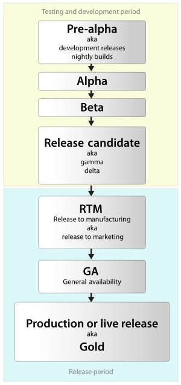
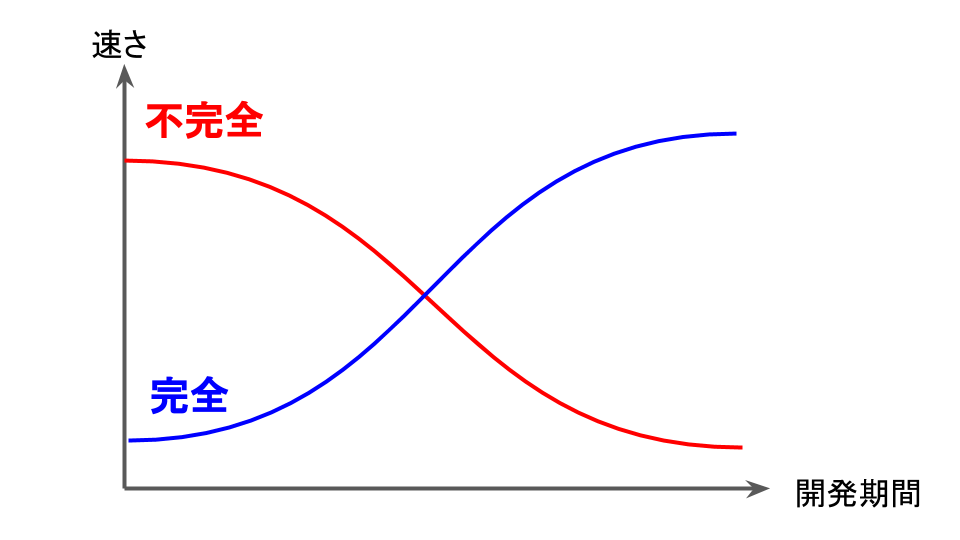
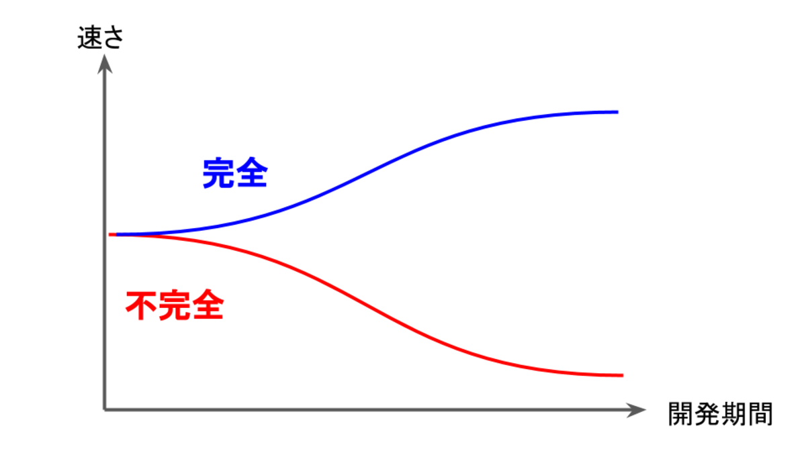
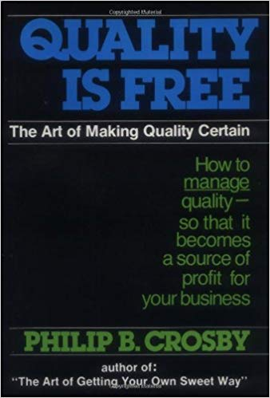
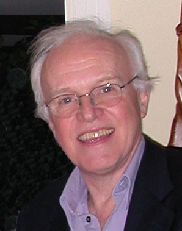

# <!--fit--> 〈完全なプログラミング〉を目指す会 2026

<!-- _class: lead title -->

## <!--fit--> 第一回〈完全なプログラミング〉

yewton

# <!--fit--> 持ち帰って欲しいこと

1.  **〈完全なプログラミング〉** とは何か
2.  なぜそれを目指すのか

# <!--fit--> この会の目的

基本的には [CODE COMPLETE 第2版](https://www.amazon.co.jp/dp/489100455X/) を題材に、
yewton の考える **〈完全なプログラミング〉** を知り、
今後のコーディングや設計の基礎的な指針を
メンバー間で擦り合わせること

*(発散しがちな根源的議論に時間をかけず、*
*真にやるべきことに集中出来るようにしたい)*

# <!--fit--> 完全な プログラミング

# <!--fit--> 🤔?

---

-   [CODE COMPLETE 第2版](https://www.amazon.co.jp/dp/489100455X/) の日本語訳のサブタイトルが **完全なプログラミングを目指して**
-   本書中に **〈完全なプログラミング〉に言及する記述は無し** :scream:

---

-   原著のサブタイトルは **A Practical Handbook of Software Construction**
    (ソフトウェアコンストラクションの実用手引き書)
-   翻訳に際して付けられた適当な煽り文句っぽい 😤

# <!--fit--> CODE COMPLETE

# <!--fit--> 🤔?

---

> A release is called **code complete** when the development team agrees that no entirely new source code will be added to this release.
> 
> *&#x2014; [Software release life cycle](https://en.wikipedia.org/wiki/Software_release_life_cycle) From Wikipedia, the free encyclopedia*

---

-   特に定まった定義は無く、「コーディング完了」くらいの意味で使われる
-   **Code complete** した後に QA が行われ、バグフィックス後リリースされる

# <!--fit--> つまり

# <!--fit--> 〈完全なプログラミング〉

## <!--fit--> なるモノの定義は存在しない

# <!--fit--> 個人的な解釈

---

> 完璧さが達成されるのは、付け加えるものがないときではなく、 **取り除くものがないとき** である
> *&#x2014; アントワーヌ・ド・サン＝テグジュペリ*

# 完全 ≠ 完璧だけど…

*perfect* を完全と訳すこともあるし(例: 完全情報ゲーム *game with perfect information* )、
敢えて目指すモノなのだから、 個人的には **Perfect な** 、
つまり機能不足が無いのは当然のこととして、
**成果物に一切余分な物がなく、またその過程にも一切の無駄が無い**
プログラミングを目指したい :muscle:

# 20 年以上前の本なんですが 😅

-   CODE COMPLETE 第2版の原著は **2004 年** 発売、つまり **20 年以上前**
-   生成 AI がコードを書く 2026 年に、こんな **化石みたいな** 本を読む必要があるんですかね？

# <!--fit--> あります

## 😤

# ソフトウェアは **人間のため**にある

-   この 20 年でツールは激変した。今や **コードの多くを AI が書く**
-   では、本質も変わったのか？
-   **否。** コードを **理解し**、最終的に **責任を負う** のは人間
-   増えたのは道具と知見。**人間の認知の限界は変わってない**

# なぜ

## <!--fit--> 〈完全なプログラミング〉

## を目指すのか

# そもそも

## <!--fit--> プログラミング

## とは？

---

-   課題定義
-   要求開発
-   計画
-   アーキテクチャ設計
-   詳細設計
-   コーディング・デバッグ
-   各種テスト
-   保守

---

-   つまり **ソフトウェアを作るためのあらゆる活動**
-   別の言葉でいうと **〈ソフトウェアコンストラクション〉**
-   少なくとも自分が行う〈プログラミング〉とはこういうモノ

# なぜ

## <!--fit--> 〈完全〉

## を目指すのか

# 社会人だから？ 仕事だから？

-   いつまでもアマチュア気分のコードじゃ困るよキミィ
-   高度にプロフェッショナルなコードを書かないとネェ

# <!--fit--> **それは違う**

# <!--fit-->〈完全〉が **〈最速〉**

## だから

# <!--fit--> 🤔?

# <!--fit--> Q. コードを読むのは誰?

# <!--fit--> A. 人間

## 🕺

---

-   え、コードを読むのはインタプリタやコンパイラでしょ
-   僕らはコードを **書く** から :moneybag: をもらっているのであって、読む必要はないでしょ
-   読みやすいコード書いて欲しいとか **甘え** でしょ

# <!--fit--> 🙅

---

-   プログラマはコードを書くのと同じくらいコードを読む
    -   *CODE COMPLETE 28.5.1 プログラマは時間をどのように使うか*
-   もっと極端な意見も
    -   コードを書いたり修正するのに2割、あとの **8割はコードの理解に費やす**
    -   [What Do Programmers Really Do Anyway? (aka Part 2 of the Yardstick saga)](https://blogs.msdn.microsoft.com/peterhal/2006/01/04/what-do-programmers-really-do-anyway-aka-part-2-of-the-yardstick-saga/)

# <!--fit--> 2026 年の ツッコミ

# <!--fit-->「でも今は  **AI が読み書き** するんでしょ?」

---

-   コードを書くのも読むのも AI に任せられる時代
-   じゃあ人間向けの **可読性なんて甘え** では? 😏

# <!--fit--> 🙅

# <!--fit--> 読み手に **AI が加わった**

---

-   読みの **回数・行数** だけなら、AI が人間を **上回りつつある** のは確か
-   けれど、問うべきは量ではない

# <!--fit--> **責任を伴う読み** は 人間にしか出来ない

---

-   レビュー・監査・障害対応 ── 結果に **責任を負う** 読みは AI に移譲できない
-   生成が **安く・速く** なったぶん、 **人間が読む瞬間** は希少で高価な資源になった
-   だからこそ、その瞬間を **安く・確実に** する〈完全〉の価値は **むしろ上がる**
    -   **「8 割は理解」** は薄まるどころか **一層効く**

# <!--fit--> 反証になる?  **AI 第一の言語** なら 可読性は要らない?

---

-   2026 年 5 月、 [**ZeroLang (Zero)**](https://zerolang.ai/) が登場
    -   *AI エージェントが読み・直し・出荷する* ことを第一に設計された言語 (Vercel Labs)
-   ところがその設計目標は **readable / inspectable / explicit**
    -   診断は構造化 (JSON)、契約は明示、隠れた挙動を排除
-   読み手が AI でも、求められるのは **「明快さ」**

# <!--fit--> 〈完全〉の価値は  **読み手が AI でも** 変わらない

# <!--fit--> プログラミングの

## <!--fit--> 大半は ****保守****

---

<!-- _class: lead quote -->

> It's **only the first 10 minutes that the code's original** , when you type it in the first time. That's it.
> *&#x2014; [The Noble Art of Maintenance Programming](https://blog.codinghorror.com/the-noble-art-of-maintenance-programming/)*

# プログラミングは

## <!--fit--> **コミュニケーション** 🤝

---

<!-- _class: lead quote -->

> プログラミングにおいてコンピュータとのやり取りはほんの15%にすぎず、85%が人とのコミュニケーションである
> *&#x2013; CODE COMPLETE 33.1 個人の資質は話題からずれているか*

---

> 愚か者はコンピュータが理解できるコードを書く。
> 優秀なプログラマは人が理解できるコードを書く。
> *&#x2014; マーティン・ファウラー*

---

<!-- _class: lead quote -->

> 最初の開発時でさえ、コードを書くことよりも読むことのほうが多い。
> 読み手の便宜を犠牲にしてまで書き手の便宜を優先しても、表面的な節約にしかならない。
> *&#x2014; CODE COMPLETE 6.2.2 良いカプセル化*

---

<!-- _class: lead quote -->

> コードを読みやすくすることは、開発プロセスのオプション部分ではない。そして、読むときの便宜ではなく書くときの便宜を図るのは不経済である。
> *&#x2014; CODE COMPLETE 34.3 人間が1番、コンピュータは2番*

---

> コードを書くときには、あなたのプログラムを保守するだれかが、あなたの居場所を知っている凶暴な変質者であると心得よ。
> *&#x2014; CODE COMPLETE 32章 読めば分かるコード*

# <!--fit-->勘違いしないで 😰

-   開発速度を犠牲にしてでも品質を上げろ
-   開発速度 < 品質
-   **じゃない！！！！！！！！**

---

# こうじゃない

---

# こう

---

# <!--fit-->こう!!!

# <!--fit--> 完全は  **はやい**

---

-   詳細な仕様書を書くより **コードで表現出来るほうが早い** に決まってる
-   コードで表現出来ないことは逐一口頭で説明するより **文書化したほうが早い** に決まってる
-   引き継ぎの時になってから記憶を頼りに資料を作るより、 **取り掛かってるときに作ったほうが早い** に決まってる
-   etc.

# もちろん

-   いきなりトップスピードを出すのは難しい
    -   自分自身のスキルもそうだけれど、プロダクトオーナーや組織の習熟度、ビジネス環境などの **外部要因も大きい**
-   **助走・投資が必要**
    -   自分自身の訓練
    -   周囲の理解・協力
    -   プロダクトへの理解を深める

# <!--fit--> 完全は  **やすい**

# <!--fit-->品質は タダである

---

> ただし、品質に対して喜んで金を出す人だけに対して
> *&#x2014; ピープルウェア 第3版 第4章 品質第一……時間さえ許せば*

---

> ソフトウェア開発は「高級料理」にはほど遠いが、ソフトウェアの品質は例外だ。
> ソフトウェア品質の原則とは、品質を改善すると開発コストが低くなることである。
> *&#x2014; CODE COMPLETE 20章 ソフトウェアの品質*

# <!--fit--> 🤔

# <!--fit--> Q. 生産性を低下させる要因は？

# <!--fit--> **エラー** 🐛

## それに伴うデバッグと修正

---

<!-- _class: lead quote -->

> ほとんどのプロジェクトで最も時間のかかるアクティビティは、正しく動作しないコードのデバッグと修正である。
> デバッグとそれに伴うリファクタリングなどの修正作業は、従来の単純なソフトウェア開発サイクルにおいて約50%の時間を占める。

---

<!-- _class: lead quote -->

> エラーを予防してデバッグを減らせば、生産性は向上する。
> したがって、開発スケジュールを短縮する最も明らかな方法とは、製品の品質を向上させ、ソフトウェアのデバッグや作業のやり直しにかかる時間を減らすことである。
> *&#x2014; CODE COMPLETE 20章 ソフトウェアの品質*

# <!--fit-->〈完全なプログラミング〉は  **はやい** ・ **やすい**

## なので

# <!--fit--> **うまい**   😋

# まとめ

1.  *(yewton が提唱する)* ****〈完全なプログラミング〉**** とは「読めば分かるコードを書く」、「必要十分なドキュメントを書く」
    など、 **余計なモノを一切必要としない** ソフトウェアづくりをすること
2.  〈完全なプログラミング〉は ****はやい**** ・ ****やすい**** 。だから ****うまい****

# ディスカッション

本日の話を踏まえ、 ****KISS**** 、 ****DRY**** 、 ****YAGNI**** の３つの原則について、これらの原則がなぜ大切にされているのかを話し合いましょう。

# Credits

-   [CODE COMPLETE 第2版](https://www.amazon.co.jp/dp/489100455X/)
-   [ピープルウエア 第3版](https://www.amazon.co.jp/dp/4822285243)
-   [Zero — An agent-first language experiment (Vercel Labs)](https://zerolang.ai/) / [vercel-labs/zero](https://github.com/vercel-labs/zero)
-   [Marp - Markdown Presentation Ecosystem](https://marp.app/)
-   [凶暴化した暴徒が鉄拳制裁のフリー素材 from ぱくたそ](https://www.pakutaso.com/20170458107post-11122.html)

