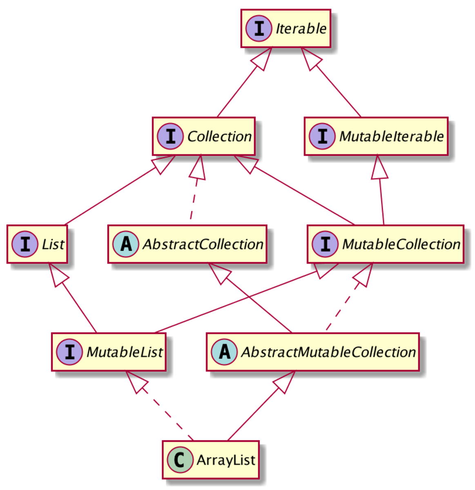
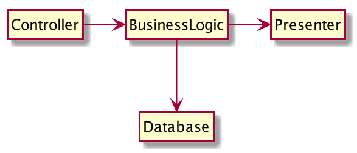
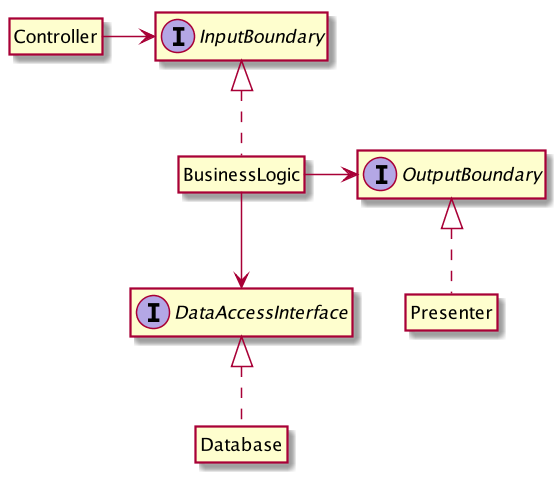
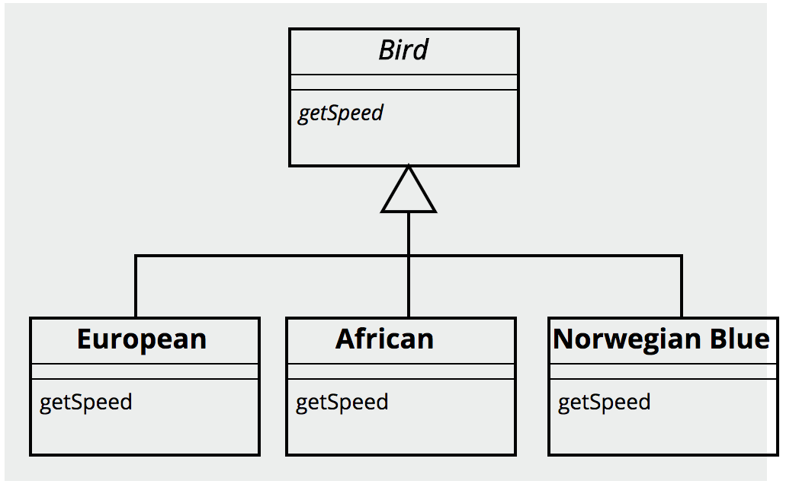

---

theme: gaia
class:
  - lead
paginate: true
_paginate: false
headingDivider: 1

title: 第二回 オブジェクト指向プログラミング
description: 〈完全なプログラミング〉を目指す会 2020 オブジェクト指向プログラミング編です
footer:  〈完全なプログラミング〉を目指す会 2020
_footer: ""

---


# <!--fit--> 〈完全なプログラミング〉を目指す会 2020


## <!--fit--> 第二回 オブジェクト指向プログラミング

yewton


# <!--fit-->オブジェクト指向<br>プログラミング


# <!--fit-->の前に


# <!--fit--> **復習**


# <!--fit-->〈完全なプログラミング〉


## とは？


# <!--fit-->「読めば分かるコードを書く」<br>「必要十分なドキュメントを書く」


# <!--fit-->余計なモノを<br>一切必要としない


## ソフトウェアづくり


# <!--fit-->その心は？


# <!--fit-->コードは圧倒的に<br> **人間によって読まれる**


# <!--fit-->故に〈完全なプログラミング〉は<br>圧倒的に **はやい**


# <!--fit-->さらに


# <!--fit-->品質の改善は<br> **コストを削減する**


# <!--fit-->故に〈完全なプログラミング〉は<br>圧倒的に **やすい**


# <!--fit--> **はやい** <br> **やすい**


# <!--fit--> **うまい** <br> 😋


# <!--fit-->三つの原則


# <!--fit-->KISS<br>DRY<br>YAGNI


# <!--fit-->なぜ〈原則〉を知ってほしいか


# <!--fit-->なぜ **〈原則〉になった** のか


# <!--fit--> 原則と呼ばれるものの多くは<br> **経験則**


## <!--fit--> 多くの人が同意した <br> **ベストプラクティス集** みたいなもん


# 同じ轍を踏むことのないよう


## <!--fit--> **DRY** に生きよう


# 今日持ち帰って欲しいこと

1.  オブジェクト指向でなぜつくるのか
2.  よいクラスとは何か
3.  ポリモーフィズムのうまみ


# <!--fit--> オブジェクト指向の<br> **歴史** に学ぶ


# <!--fit-->問題


# **オブジェクト指向の発明** と<br> **オブジェクトやクラスの登場** <br> どちらが先か


# <!--fit-->正解は


# <!--fit--> **オブジェクトやクラスの登場**

---

-   先に ****オブジェクト**** や ****クラス**** という概念を盛り込んだ ****言語**** が作られた
    -   対象とする問題領域の表現に有用だったから
    -   当初は ****オブジェクト指向という言葉はなかった****
-   言語から着想を得てオブジェクト指向という概念が生まれ、その概念を体現するオブジェクト指向言語が生まれていった


# <!--fit-->問題


# <!--fit--> **オブジェクトやクラスが** <br> **最初に登場した言語** <br>とは？


# <!--fit-->正解は


# <!--fit-->Simula 67

---


## 1967年 - Simula 67


## 1980年 - Smalltalk


## 1983年 - C++


# <!--fit-->何が言いたいか


# <!--fit-->オブジェクト指向とは、


## 複雑な問題解決のために<br> 遥か昔に発明され、今日まで現役の <br> **「問題の考え方」**


# <!--fit-->役に立たない <br> ワケがない


# <!--fit-->問題


# <!--fit--> **クラス** とは？


# <!--fit-->正解は

---

> クラスとは、強くて明確な責務(responsibility)を共有するデータとルーチンの集まりである。
> *&#x2014; CODE COMPLETE 第6章 クラスの作成*


# <!--fit--> どうして **クラス** を作るのか？

---

> プログラム全体を一気に頭に詰め込むべきではない。
> プログラムの部分ごとに集中できるように、プログラムを整理して、一度に検討するプログラムの量は、最小限にとどめることを目指すべきである。
> *&#x2014; CODE COMPLETE 5.2.1 ソフトウェアの鉄則：複雑さへの対処*

---

> 有能なプログラマは自分の脳味噌のサイズがいかに制限されたものであるかをよく心得ています
> *&#x2014; エドガー・W・ダイクストラ [謙虚なるプログラマ (The Humble Programmer)](http://www.unixuser.org/~euske/doc/dijkstra-ja/thehumbleprogrammer.html)*


# <!--fit--> こんなときに **クラス** を作る


# 現実世界のオブジェクト<br>または抽象的なオブジェクト( `Circle` に対する `Shape` など )を<br>モデリングする

---

> プログラミングでは、抽象化がShapeのように用意されているわけではないので、
> つじつまの合った抽象化を何とか考え出さなければならない。
> 適切な抽象オブジェクトを考え出すことは、オブジェクト指向設計における主な課題の1つである。
> *&#x2014; CODE COMPLETE 6.4 クラスを作成する理由*


# <!--fit-->複雑さを **緩和** ・ **分離** ・ **隠蔽** する

---

> クラスを作成する最も重要な理由は、プログラムの複雑さを低減することである。
> クラスの抽象化の威力を利用しなければ、複雑なプログラムを頭で整理することは不可能である。
> *&#x2014; CODE COMPLETE 6.4 クラスを作成する理由*


# その他

-   変更による影響を限定する
-   グローバルデータを隠蔽する
-   引数の受け渡しを合理化する
-   制御を一元化する
-   コードの再利用を促進する
-   プログラムのファミリを計画する
    -   独立したプログラムの組み合わせでソフトウェアを構成する
-   関連する操作をパッケージにまとめる
-   特定のリファクタリングを実行する


# <!--fit--> **望ましくない** <br>クラス


# <!--fit-->God クラス


---


> 全知全能のクラスを作成してはならない。
> クラスがGet()ルーチンやSet()ルーチンを使って他のクラスからデータを取得することに明け暮れているなら
> （つまり、他人の領分に首を突っ込み、あれこれ口出ししているようなら）、
> それをゴッドクラスにまとめるよりも、他のクラスに整理する方がよいかどうか検討しよう
> *&#x2014; CODE COMPLETE 6.4.1 望ましくないクラス*


# <!--fit--> `FooManager` <br> `BarHelper` <br> `FizzHandler` <br> `BuzzInfo`


---

-   意味が広範過ぎる単語は怪しむ
-   より明確な名前がないか一晩考える
    -   `Supervisor`, `Context`, `Pool`, etc&#x2026;
-   [クラスの命名のアンチパターン - Qiita](https://qiita.com/magicant/items/8134edf969f9629fa66e)
-   [I Shall Call It.. SomethingManager](https://blog.codinghorror.com/i-shall-call-it-somethingmanager/)


# <!--fit-->[Object Calisthenics](https://williamdurand.fr/2013/06/03/object-calisthenics/) <br> オブジェクト指向健康体操


# <!--fit-->クラスは **50行まで**


# <!--fit-->パッケージは **10ファイルまで**


# <!--fit-->インスタンス変数は **2個まで**


# <!--fit-->" `.` " は1行につき **1個まで**


(デメテルの法則)


# <!--fit--> **よい** クラス


# <!--fit--> **SOLID**


# <!--fit--> **単一責務の原則** <br> *Single responsibility principle*


# <!--fit-->クラスを変更する理由は<br> **常に1つ** でなければならない


# <!--fit--> **あるクラスを変更したいと思う人** は<br> **ひとり** だけ

---

-   見た目を変えたい
-   ビジネスルールを変えたい
-   ミドルウェアを変えたい
-   計算量を減らしたい
-   通信量を減らしたい
-   etc.


# <!--fit--> **オープンクローズドの原則** <br> *Open/closed principle*


# <!--fit-->モジュールは **拡張に対して開いて** いなければならず<br> **修正に対して閉じて** いなければならない

---


# <!--fit--> **拡張に対して開いている**


## 他の関連機能を実装するベースとして<br>使えなければならない


# <!--fit--> **修正に対して閉じている**


## 既存の振る舞いを変更することは出来ない、する必要がない

---


---

何か新しいことをやりたいときに、
既存のクラスを **修正せずに** そのまま、
**簡単に利用出来る** つくりになっていると素敵だね


# <!--fit--> **リスコフの置換原則** <br> *Liskov substitution principle*


# <!--fit-->サブクラスをその基底クラスと<br>置き換えることが出来なければならない

クラス `S` がクラス `T` のサブクラスである場合に、
プログラム中で使われる `T` のインスタンスは、
何ら修正を加えることなく `S` のインスタンスに置き換えることが出来なければならない


# <!--fit-->長方形と正方形

---

```java
public class Rectangle {
    private int length;
    private int breadth;

    public int getLength() {
        return length;
    }
    public void setLength(int length) {
        this.length = length;
    }
    public int getBreadth() {
        return breadth;
    }
    public void setBreadth(int breadth) {
        this.breadth = breadth;
    }
    public int getArea() {
        return this.length * this.breadth;
    }
}
```

---

```java
public class Square extends Rectangle {
    @Override
    public void setBreadth(int breadth) {
        super.setBreadth(breadth);
        super.setLength(breadth);
    }
    @Override
    public void setLength(int length) {
        super.setLength(length);
        super.setBreadth(length);
    }
}
```

---

サブクラスであることが制限にしか感じなくなったら怪しい

結局クラスごとの場合分け書いてたら怪しい

それは本当に is-a 関係なのか考えよう


# <!--fit--> **インターフェース分離の原則** <br> *Interface segregation principle*


# <!--fit-->クライアントが使用しないインターフェイスに<br>クライアントを強制的に依存させてはならない

---


# <!--fit--> `java.util.ArrayList`


# <!--fit--> `kotlin.collections.ArrayList`



---


# <!--fit--> **依存関係逆転の原則** <br> *Dependency inversion principle*


# 上位モジュールを下位モジュールに依存させるのではなく<br>両方のモジュールを **抽象化に依存させる** べきである


# <!--fit-->実装ではなく **抽象に依存せよ**

---


# 制御の流れ




# 依存関係を逆転




# <!--fit--> **ポリモーフィズム**

-   同一のインタフェースを **複数の型に対して** 定義出来ること
-   異なるクラスが **同一のメッセージに対して** 応答出来ること

---

> 実行時まで処理するドアの種類を知らないOpen()やClose()のような操作をサポートする言語の機能を「ポリモーフィズム」という。
> *&#x2014; CODE COMPLETE 5.3.4 設計が単純になる場合の継承*

---

-   日本語では **多態性** とか **多相** とも
-   いくつか種類がある
    -   サブタイピング(単にポリモーフィズムという場合だいたいこれ)
    -   パラメータ(総称型とか)
    -   アドホック(オーバーロードとか)

---

> ■広範な型チェックよりもポリモーフィズムを選ぶ
> 
> case文の数が増えてきたら、継承を使って設計した方がよいという兆候かもしれない。
> *&#x2014; CODE COMPLETE 6.3.2 継承(「is a」の関係)*


# 継承による具体例

from [Replace Conditional with Polymorphism](http://refactoring.com/catalog/replaceConditionalWithPolymorphism.html)

---

```java
class Bird {
  // ...
  double getSpeed()
    switch (mType) {
      case EUROPEAN:
        return getBaseSpeed();
      case AFRICAN:
        return getBaseSpeed() - getLoadFactor() * mNumberOfCoconuts;
      case NORWEGIAN_BLUE:
        return (mIsNailed) ? 0 : getBaseSpeed(mVoltage);
    }
    throw new RuntimeException ("Should be unreachable");
}
```

---




# <!--fit-->何が嬉しいのか


# <!--fit-->マジックナンバー<br> **7 ± 2** <br>(4 ± 1, 5 ± 3 という説も)

---

-   人間が一度に考えられるモノゴトの限界
-   **ある特定のケースにだけ関心があるときに、ずらずらと列挙された case 文を読むのは苦行**
    -   読み違いも起こりやすい


# <!--fit-->[求めるな、命じよ](http://martinfowler.com/bliki/TellDontAsk.html)<br> *Tell-Don't-Ask*

-   どう振る舞うべきかはその **オブジェクト自身** が知っている
-   データと振る舞いを密接に関連付ける OOP の原則
-   これが **ポリモーフィズムを使って実現出来る** 場合もある


# <!--fit-->ただし


# <!--fit--> **継承よりも合成を** <br> *Composition over inheritance*

-   継承は強力だが使いこなすのは難しい
    -   そもそも真に継承関係にあるような事象は稀
-   **リスコフの置換原則が守られないなら使ってはいけない**
-   合成ですんなり表現出来るならそれでいい


# <!--fit--> そして **DIP** 再び

-   依存関係を逆転出来るのは **ポリモーフィズムのおかげ**
-   依存関係を逆転出来るということは **関心事のスコープを限定出来る** ということ
-   ここに **オブジェクト指向の真価がある** と言っても過言ではない


# <!--fit-->まとめ


# <!--fit-->オブジェクト指向でなぜつくるのか


# <!--fit--> **複雑な問題** を <br> **人間が解決できるようにする** ため


# <!--fit-->よいクラスとは


# <!--fit--> **SOLID**


# <!--fit-->ポリモーフィズムのうまみ

---

-   **継承は問題を適切に表現出来る場合に** 威力を発揮する
    -   濫用すると **人間の能力を越えた複雑度になりかねない**
-   インターフェースを介した **依存関係逆転こそがオブジェクト指向の真価**
-   問題の大きさを **人間が扱えるサイズに収める** ために使う


# 参考書籍

-   [日経BP SHOP｜Code Complete 第2版 上 － 完全なプログラミングを目指して](https://shop.nikkeibp.co.jp/front/commodity/0000/589000/)
-   [日経BP SHOP｜Code Complete 第2版 下 － 完全なプログラミングを目指して](https://shop.nikkeibp.co.jp/front/commodity/0000/589100/)
-   [オブジェクト指向でなぜつくるのか第2版 知っておきたいOOP、設計、関数型言語の基礎知識](https://shop.nikkeibp.co.jp/front/commodity/0000/P84650/)
-   [Martin, Clean Architecture: A Craftsman's Guide to Software Structure and Design | Pearson](https://www.pearson.com/us/higher-education/program/Martin-Clean-Architecture-A-Craftsman-s-Guide-to-Software-Structure-and-Design/PGM333762.html)


# Credits

-   [Alex Ceban](https://pixabay.com/ja/users/alexceban-2463891/?utm_source=link-attribution&utm_medium=referral&utm_campaign=image&utm_content=4245645) による [Pixabay](https://pixabay.com/ja/?utm_source=link-attribution&utm_medium=referral&utm_campaign=image&utm_content=4245645) からの画像
-   [インターネットの神様のイラスト | かわいいフリー素材集 いらすとや](https://www.irasutoya.com/2016/07/blog-post_864.html)
-   [Open-source tool that uses simple textual descriptions to draw beautiful UML diagrams.](https://plantuml.com/ja/)

